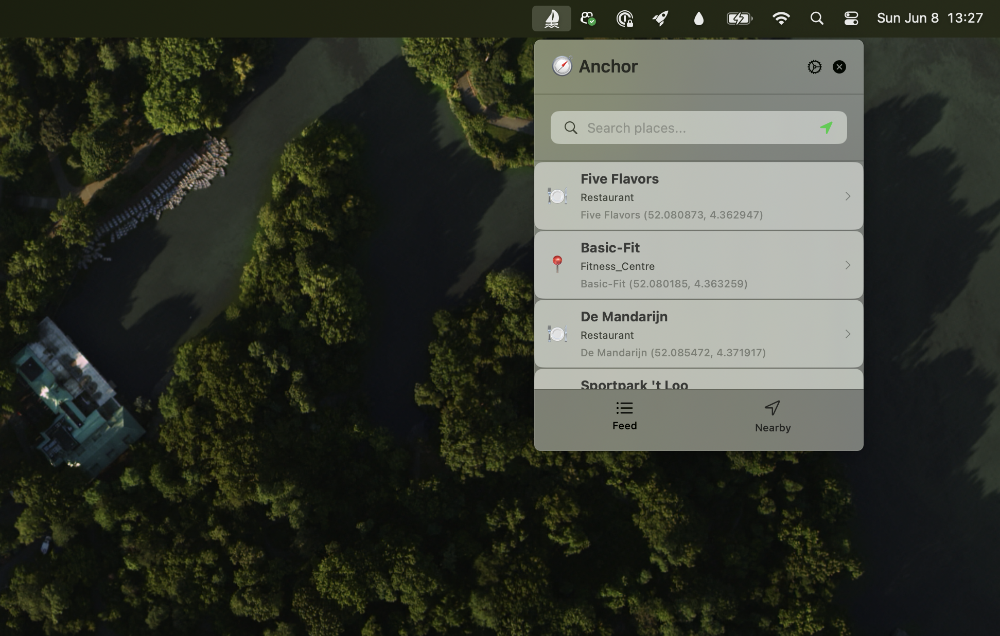
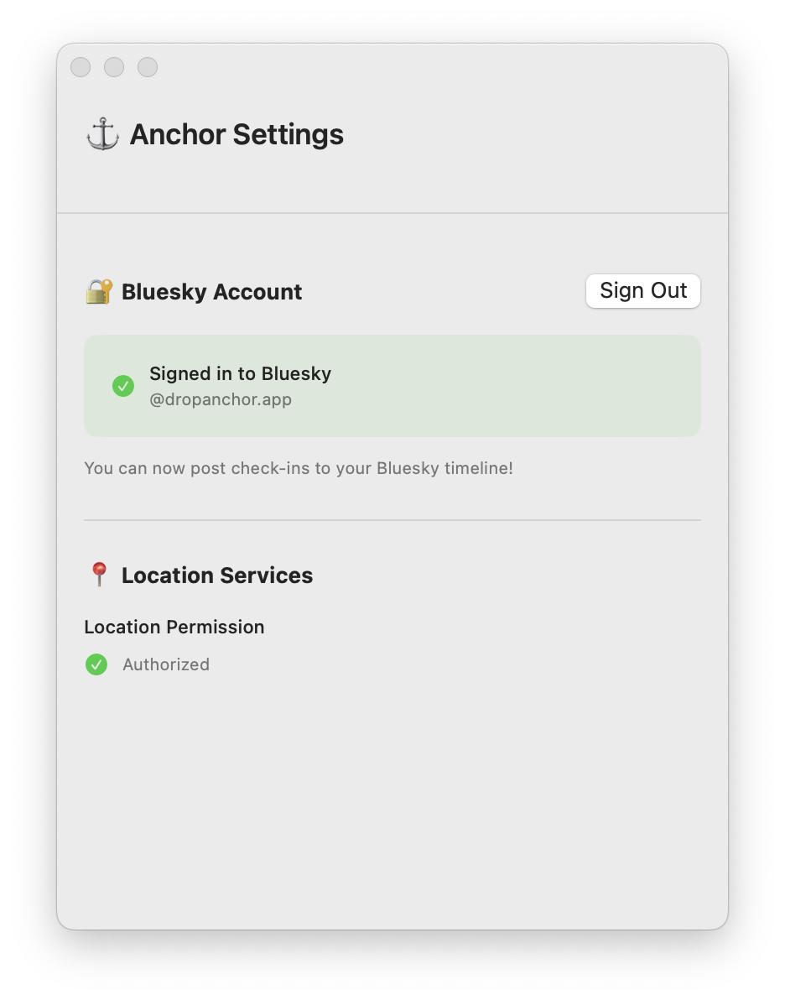

# 🧭 Anchor

<p align="center">
  
</p>

<p align="center">
  <strong>Native macOS and iOS apps for location-based check-ins using the AT Protocol</strong>
</p>

<p align="center">
  <a href="https://github.com/dropanchorapp/Anchor/actions/workflows/tests.yml">
    
  </a>
  <a href="https://github.com/dropanchorapp/Anchor/actions/workflows/swiftlint.yml">
    
  </a>
</p>

<p align="center">
  Drop anchor at your favorite places with structured data storage on AnchorPDS and optional social sharing via Bluesky.
</p>

## ✨ Features

- **🖥️ Native macOS Menubar App** - Always accessible from your menubar with a single click
- **📱 Native iOS App** - Full-featured mobile experience using shared business logic
- **🔐 StrongRef Architecture** - Store address records and check-ins with content integrity on user's PDS, plus optional Bluesky posting
- **📍 Automatic Location** - CoreLocation integration with proper platform permissions
- **🗺️ Place Discovery** - Find nearby climbing gyms, cafes, and points of interest via OpenStreetMap
- **💬 Custom Messages** - Add personal notes to your check-ins
- **🏗️ Modular Architecture** - Shared AnchorKit framework across macOS and iOS
- **🎯 Privacy-First** - Local storage only, no tracking or analytics
- **🌐 AT Protocol Native** - Uses community lexicon standards for structured location data

## 📱 Screenshots

<p align="center">
  
  
</p>

<p align="center">
  <em>Check-in interface and settings panel</em>
</p>

## 🚀 Quick Start

### System Requirements

- **macOS**: macOS 14 or later
- **iOS**: iOS 26 or later  
- Location Services enabled

### Installation

1. **Download from Releases** (Coming Soon)

   Download the latest `.dmg` from our [Releases page](https://github.com/tijs/Anchor/releases)

2. **Build from Source**

   ```bash
   # Clone the repository
   git clone https://github.com/tijs/Anchor.git
   cd Anchor
   
   # Open in Xcode and build both targets
   open Anchor/Anchor.xcodeproj
   
   # Or build from command line
   # macOS app:
   xcodebuild -project Anchor/Anchor.xcodeproj -scheme Anchor build
   # iOS app:
   xcodebuild -project Anchor/Anchor.xcodeproj -scheme AnchorMobile build
   ```

### First Launch

#### macOS App

1. **Launch Anchor** - Look for the anchor (⚓) icon in your menubar
2. **Enable Location Services** - Click "Enable Location" when prompted
3. **Sign in to Bluesky** - Click "Sign In" and enter your Bluesky credentials
4. **Drop Your First Anchor** - Click "Nearby" to check in at your current location

#### iOS App

1. **Launch Anchor** - Tap the Anchor app icon
2. **Enable Location Services** - Allow location access when prompted
3. **Sign in to Bluesky** - Enter your Bluesky credentials in Settings
4. **Drop Your First Anchor** - Tap "Nearby" to discover and check in at places

## 🎯 How to Use

### Quick Check-in

The fastest way to check in:

1. Click the anchor icon in your menubar
2. Navigate to "Nearby" tab
3. Select a place and drop anchor
4. **Optional**: Toggle "Also post to Bluesky" to control social sharing

**Note**: All check-ins are stored on your PDS using StrongRef architecture regardless of your Bluesky posting preference.

### How Anchor Works: StrongRef Architecture

Anchor uses a **StrongRef-based architecture** that stores structured address and check-in records on your Personal Data Server (PDS) with content integrity verification:

#### 1. **Address Records** - Reusable Venue Data

Venue information is stored separately as reusable address records using community lexicon standards:

```json
{
  "$type": "community.lexicon.location.address",
  "name": "Klimmuur Centraal",
  "street": "Stationsplein 45",
  "locality": "Utrecht",
  "region": "UT",
  "country": "NL",
  "postalCode": "3511ED"
}
```

#### 2. **Check-in Records** - StrongRef to Address

Check-ins reference address records via StrongRef with content integrity verification:

```json
{
  "$type": "app.dropanchor.checkin",
  "text": "Great lunch session with the team!",
  "createdAt": "2024-12-29T14:30:00Z",
  "addressRef": {
    "uri": "at://did:plc:user123/community.lexicon.location.address/abc123",
    "cid": "bafyreigh2akiscaildc..."
  },
  "coordinates": {
    "$type": "community.lexicon.location.geo",
    "latitude": "52.0705",
    "longitude": "4.3007"
  }
}
```

#### 3. **Optional Bluesky Posts** - Share with Your Network

When you enable "Also post to Bluesky" (enabled by default), Anchor creates rich posts on your Bluesky feed:

**What you see on Bluesky:**

```
Dropped anchor at Klimmuur Centraal 🧭
"Great lunch session with the team!" 🧗‍♂️
```

**Under the hood (`app.bsky.feed.post`):**

```json
{
  "$type": "app.bsky.feed.post",
  "text": "Dropped anchor at Klimmuur Centraal 🧭\n\"Great lunch session with the team!\" 🧗‍♂️",
  "createdAt": "2024-12-29T14:30:00Z",
  "facets": [
    {
      "index": { "byteStart": 17, "byteEnd": 35 },
      "features": [{ 
        "$type": "app.bsky.richtext.facet#link", 
        "uri": "https://www.openstreetmap.org/way/123456" 
      }]
    }
  ]
}
```

#### Why This Architecture?

This StrongRef-based approach provides powerful benefits:

- **🔗 Content Integrity** - CID verification ensures address records haven't been tampered with
- **♻️ Data Efficiency** - Reusable address records reduce storage duplication
- **🏠 Self-Contained** - All data stored on your PDS with no external dependencies
- **🌐 Social Sharing** - Optional Bluesky posts for your social network
- **📊 Future Features** - Rich querying and analytics from structured data
- **🔐 Privacy Control** - Choose what to share publicly vs. keep private
- **🌍 AT Protocol Native** - Uses community lexicon standards for interoperability
- **🛡️ Standards Compliant** - Follows AT Protocol best practices for record linking

## 🏗️ Architecture

Anchor is built with a modular architecture designed for cross-platform expansion:

### Core Components

- **Anchor (macOS App)** - Native SwiftUI menubar application
- **AnchorMobile (iOS App)** - Native iOS app using shared AnchorKit
- **AnchorKit** - Shared business logic framework across all platforms
- **AnchorPDS** - Dedicated Personal Data Server for structured check-in storage

### Technology Stack

- **Swift 6** - Modern async/await concurrency with strict concurrency checking
- **SwiftUI** - Native macOS user interface with MenuBarExtra
- **AT Protocol** - StrongRef-based record architecture with content integrity verification
- **Community Lexicon** - Uses `community.lexicon.location.*` standards for structured address data
- **CoreLocation** - Native location services with proper permission handling
- **Overpass API** - Rich OpenStreetMap place data via `overpass.private.coffee`

### Project Structure

```text
Anchor/
├── Anchor/                    # macOS MenuBar App
│   ├── Anchor.xcodeproj      # Xcode project (includes both targets)
│   ├── Assets.xcassets/      # App icons and assets
│   └── Features/             # SwiftUI views organized by feature
│       ├── CheckIn/Views/    # Drop anchor interface
│       ├── Core/Views/       # Main content view
│       ├── Feed/Views/       # Future: check-in history
│       ├── Nearby/Views/     # Place discovery
│       └── Settings/Views/   # App configuration
├── AnchorMobile/             # iOS App
│   ├── Assets.xcassets/      # iOS-specific assets
│   ├── Features/             # iOS SwiftUI views
│   │   ├── CheckIn/         # Mobile check-in interface
│   │   ├── Feed/            # Mobile feed views
│   │   └── Settings/        # iOS settings views
│   └── AnchorMobileApp.swift # iOS app entry point
├── AnchorKit/                # Shared Business Logic
│   ├── Sources/AnchorKit/
│   │   ├── Models/          # Place, AuthCredentials, Settings
│   │   ├── Services/        # AnchorPDS, Bluesky, Overpass, Location
│   │   ├── ATProtocol/      # AT Protocol client implementations
│   │   └── Utils/           # Shared utilities
│   └── Tests/               # Unit tests (46+ tests)
└── Static/                  # Assets and documentation
```

**Note**: AnchorPDS backend is a separate project available at <https://www.val.town/x/tijs/anchorPDS>

## 🔧 Development

### Building AnchorKit

The shared framework can be built and tested independently:

```bash
cd AnchorKit
swift build
swift test  # Runs 46+ tests including StrongRef integration
```

### Building the Apps

```bash
# Using Xcode (recommended for both macOS and iOS)
open Anchor/Anchor.xcodeproj

# Using xcodebuild
# macOS app:
xcodebuild -project Anchor/Anchor.xcodeproj -scheme Anchor build
# iOS app:  
xcodebuild -project Anchor/Anchor.xcodeproj -scheme AnchorMobile build
```

### Running Tests

```bash
# Test AnchorKit (includes StrongRef and AT Protocol client tests)
cd AnchorKit && swift test

# Test the apps
# macOS app tests:
xcodebuild -project Anchor/Anchor.xcodeproj -scheme Anchor test
# iOS app tests:
xcodebuild -project Anchor/Anchor.xcodeproj -scheme AnchorMobile test
```

### AnchorPDS

AnchorPDS is a separate project hosted on Val Town. You can experiment with it at: <https://www.val.town/x/tijs/anchorPDS>

## 🔒 Privacy & Security

- **Local Storage Only** - All data stored locally in macOS UserDefaults
- **No Analytics** - Zero tracking, telemetry, or user behavior monitoring  
- **Minimal Permissions** - Only requests location access when needed
- **Secure Authentication** - Bluesky credentials handled via AT Protocol best practices
- **Open Source** - Complete transparency with public source code

## 🛣️ Roadmap

### ✅ Completed (v1.0)

- [x] Native macOS menubar app
- [x] **StrongRef Architecture** - Atomic address + checkin records with content integrity
- [x] **Community Lexicon Integration** - Uses AT Protocol standards for structured location data
- [x] **Content Integrity** - CID verification prevents tampering and detects modifications
- [x] Location services integration
- [x] Nearby place discovery
- [x] Modular AnchorKit architecture

### 🔄 In Progress (v1.1)

- [ ] App Store distribution (both macOS and iOS)
- [ ] Check-in history view (from AnchorPDS)
- [ ] Default message preferences
- [ ] Launch at login option (macOS)
- [ ] Global feed discovery

### 🚀 Future (v2.0+)

- [x] **iOS App** - Full iOS app using shared AnchorKit ✅
- [ ] **Apple Watch App** - Quick drops from your wrist
- [ ] **Rich Analytics** - Personal insights from StrongRef-structured check-in data
- [ ] **Shortcuts Integration** - Automate check-ins
- [ ] **Federation** - Connect with other Anchor instances
- [ ] **Social Features** - Follow friends' check-ins across the AT Protocol network

## 🤝 Contributing

We welcome contributions! The modular architecture makes it easy to contribute to specific areas:

- **AnchorKit** - Business logic, models, and services
- **macOS App** - SwiftUI interface and platform-specific features  
- **iOS App** - Mobile interface and iOS-specific features
- **Documentation** - Help improve guides and API docs

Please check our [Contributing Guidelines](CONTRIBUTING.md) before submitting pull requests.

## 📄 License

MIT License - see [LICENSE](LICENSE) for details.

## 🔗 Connect

- **Bluesky**: [@anchor.app](https://bsky.app/profile/anchor.app) - Follow us for updates
- **AT Protocol**: [atproto.com](https://atproto.com) - Learn about the decentralized web
- **OpenStreetMap**: [openstreetmap.org](https://openstreetmap.org) - The collaborative mapping project powering our place data

---

**Made with ❤️ for the climbing and outdoor community**

*Join the decentralized social web and start dropping anchors at your favorite places today.*
