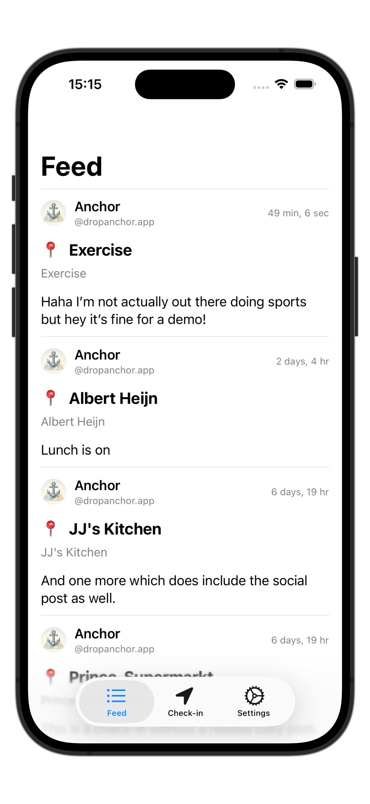
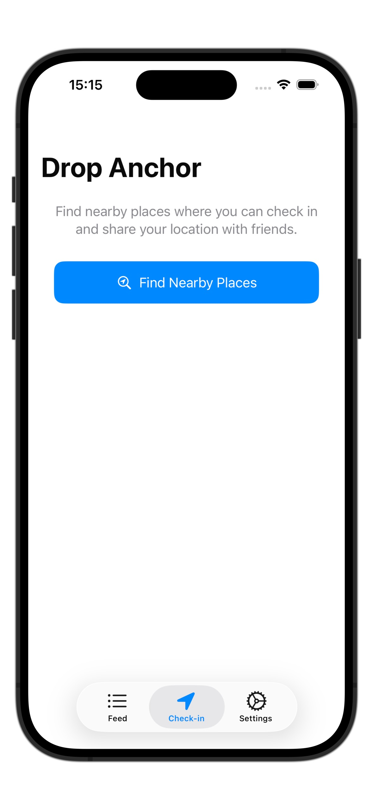
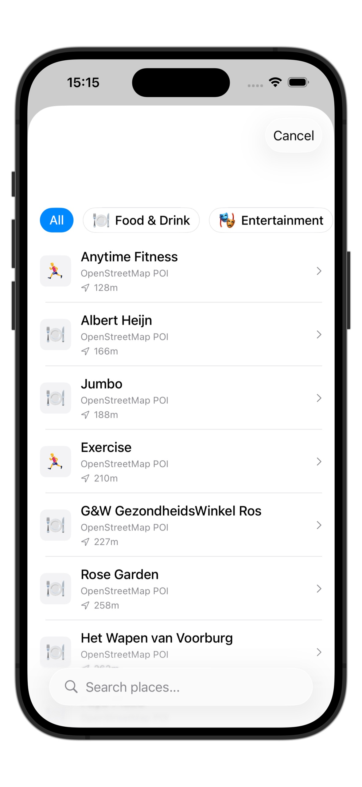
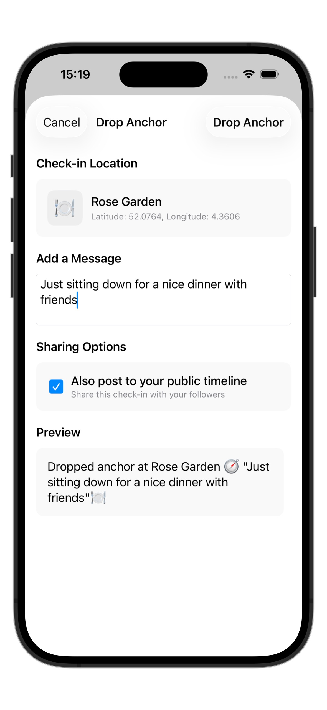

# 🧭 Anchor

<p align="center">
  
</p>

<p align="center">
  <strong>Native iOS app for location-based check-ins using the AT Protocol</strong>
</p>

<p align="center">
  <a href="https://github.com/dropanchorapp/Anchor/actions/workflows/tests.yml">
    
  </a>
  <a href="https://github.com/dropanchorapp/Anchor/actions/workflows/swiftlint.yml">
    
  </a>
</p>

<p align="center">
  Drop anchor at your favorite places with structured data storage on your home PDS and optional social sharing via Bluesky.
</p>

## ✨ Features

- **📱 Native iOS App** - Full-featured mobile experience with native location services
- **🔐 StrongRef Architecture** - Store address records and check-ins with content integrity on your home PDS
- **📡 Optional Social Sharing** - Choose to share check-ins as posts on Bluesky to notify your followers
- **🌍 Global Feed** - Discover check-ins from around the world via the Anchor AppView feed
- **📍 Automatic Location** - CoreLocation integration with proper iOS permissions
- **🗺️ Place Discovery** - Find nearby climbing gyms, cafes, and points of interest via OpenStreetMap
- **💬 Custom Messages** - Add personal notes to your check-ins
- **🏗️ Modular Architecture** - Shared AnchorKit framework for future platform expansion
- **🎯 Privacy-First** - All data stored on your own PDS, no tracking or analytics
- **🌐 AT Protocol Native** - Uses community lexicon standards for structured location data

## 📱 Screenshots

<p align="center">
  
  
  
  
</p>

<p align="center">
  <em>Global feed, check-in interface, nearby places discovery, and message composition</em>
</p>

## 🚀 Quick Start

### System Requirements

- **iOS**: iOS 17.0 or later  
- Location Services enabled

### Installation

1. **Download from App Store** 

   Coming soon to the iOS App Store

2. **Build from Source**

   ```bash
   # Clone the repository
   git clone https://github.com/tijs/Anchor.git
   cd Anchor
   
   # Open in Xcode and build
   open Anchor/Anchor.xcodeproj
   
   # Or build from command line
   xcodebuild -project Anchor/Anchor.xcodeproj -scheme AnchorMobile build -destination 'platform=iOS Simulator,name=iPhone 16'
   ```

### First Launch

1. **Launch Anchor** - Tap the Anchor app icon
2. **Browse Global Feed** - See check-ins from around the world on the Feed tab
3. **Enable Location Services** - Allow location access when prompted for check-ins
4. **Sign in to Bluesky** - Enter your Bluesky credentials in Settings to create check-ins
5. **Drop Your First Anchor** - Tap "Check In" to discover and check in at nearby places

## 🎯 How to Use

### Quick Check-in

The fastest way to check in:

1. Open the Anchor app
2. Tap "Check In" tab
3. Select a nearby place and drop anchor
4. **Optional**: Toggle "Also post to Bluesky" to share with your followers

**Note**: All check-ins are stored on your home PDS using StrongRef architecture regardless of your Bluesky posting preference. The optional Bluesky post is separate from your structured check-in data.

### How Anchor Works: StrongRef Architecture

Anchor uses a **StrongRef-based architecture** that stores structured address and check-in records on your Personal Data Server (PDS) with content integrity verification:

#### 1. **Address Records** - Reusable Venue Data

Venue information is stored separately as reusable address records using community lexicon standards:

```json
{
  "$type": "community.lexicon.location.address",
  "name": "Klimmuur Centraal",
  "street": "Stationsplein 45",
  "locality": "Utrecht",
  "region": "UT",
  "country": "NL",
  "postalCode": "3511ED"
}
```

#### 2. **Check-in Records** - StrongRef to Address

Check-ins reference address records via StrongRef with content integrity verification:

```json
{
  "$type": "app.dropanchor.checkin",
  "text": "Great lunch session with the team!",
  "createdAt": "2025-01-30T14:30:00Z",
  "addressRef": {
    "uri": "at://did:plc:user123/community.lexicon.location.address/abc123",
    "cid": "bafyreigh2akiscaildc..."
  },
  "coordinates": {
    "$type": "community.lexicon.location.geo",
    "latitude": "52.0705",
    "longitude": "4.3007"
  },
  "image": {
    "thumb": {
      "$type": "blob",
      "ref": { "$link": "bafkreiabcdef..." },
      "mimeType": "image/jpeg",
      "size": 125000
    },
    "fullsize": {
      "$type": "blob",
      "ref": { "$link": "bafkreighijk..." },
      "mimeType": "image/jpeg",
      "size": 450000
    },
    "alt": "Photo of the team at lunch"
  }
}
```

#### 3. **Optional Bluesky Posts** - Share with Your Network

When you enable "Also post to Bluesky", Anchor creates rich posts on your Bluesky feed to notify your followers:

**What you see on Bluesky:**

```
Dropped anchor at Klimmuur Centraal 🧭
"Great lunch session with the team!" 🧗‍♂️
```

**Under the hood (`app.bsky.feed.post`):**

```json
{
  "$type": "app.bsky.feed.post",
  "text": "Dropped anchor at Klimmuur Centraal 🧭\n\"Great lunch session with the team!\" 🧗‍♂️",
  "createdAt": "2025-01-30T14:30:00Z",
  "facets": [
    {
      "index": { "byteStart": 17, "byteEnd": 35 },
      "features": [{ 
        "$type": "app.bsky.richtext.facet#link", 
        "uri": "https://www.openstreetmap.org/way/123456" 
      }]
    }
  ]
}
```

#### Why This Architecture?

This StrongRef-based approach provides powerful benefits:

- **🔗 Content Integrity** - CID verification ensures address records haven't been tampered with
- **♻️ Data Efficiency** - Reusable address records reduce storage duplication
- **🏠 Self-Contained** - All data stored on your home PDS with no external dependencies
- **🌐 Optional Social Sharing** - Choose when to share check-ins as Bluesky posts
- **📊 Rich Query Capability** - Structured data enables powerful future features
- **🔐 Privacy Control** - Your data stays on your PDS unless you choose to share
- **🌍 AT Protocol Native** - Uses community lexicon standards for interoperability
- **🛡️ Standards Compliant** - Follows AT Protocol best practices for record linking

## 🏗️ Architecture

Anchor is built with a modular architecture designed for cross-platform expansion:

### Core Components

- **AnchorMobile (iOS App)** - Native iOS app built with SwiftUI
- **AnchorKit** - Shared business logic framework for future platform expansion
- **Anchor AppView** - Global feed service aggregating check-ins from across the AT Protocol network

### Technology Stack

- **Swift 6** - Modern async/await concurrency with strict concurrency checking
- **SwiftUI** - Native iOS user interface with NavigationStack and TabView
- **AT Protocol** - StrongRef-based record architecture with content integrity verification
- **Community Lexicon** - Uses `community.lexicon.location.*` standards for structured address data
- **CoreLocation** - Native location services with proper iOS permission handling
- **Overpass API** - Rich OpenStreetMap place data via `overpass.private.coffee`

### Project Structure

```text
Anchor/
├── Anchor.xcodeproj          # Xcode project
├── AnchorMobile/             # iOS App
│   ├── Assets.xcassets/      # iOS assets and icons
│   ├── Features/             # SwiftUI views organized by feature
│   │   ├── CheckIn/Views/    # Mobile check-in interface
│   │   ├── Feed/Views/       # Feed and timeline views
│   │   └── Settings/Views/   # iOS settings views
│   └── AnchorMobileApp.swift # iOS app entry point
├── AnchorKit/                # Shared Business Logic Package
│   ├── Sources/AnchorKit/
│   │   ├── Models/          # Place, AuthCredentials, Settings
│   │   ├── Services/        # Overpass, Location, Feed services
│   │   ├── ATProtocol/      # AT Protocol client implementations
│   │   ├── Stores/          # CheckIn, Auth, and data stores
│   │   └── Utils/           # Shared utilities and configuration
│   └── Tests/               # Unit tests (46+ tests)
└── Static/                  # Assets and documentation
```

**Note**: Anchor AppView backend is a separate project available at <https://dropanchor.app>

## 🔧 Development

### Building AnchorKit

The shared framework can be built and tested independently:

```bash
cd AnchorKit
swift build
swift test  # Runs 46+ tests including StrongRef integration
```

### Building the App

```bash
# Using Xcode (recommended)
open Anchor/Anchor.xcodeproj

# Using xcodebuild
xcodebuild -project Anchor/Anchor.xcodeproj -scheme AnchorMobile build -destination 'platform=iOS Simulator,name=iPhone 16'
```

### Running Tests

```bash
# Test AnchorKit (includes StrongRef and AT Protocol client tests)
cd AnchorKit && swift test

# Test the iOS app
xcodebuild -project Anchor/Anchor.xcodeproj -scheme AnchorMobile test -destination 'platform=iOS Simulator,name=iPhone 16'
```

### Anchor AppView

Anchor AppView is a separate project that provides the global feed service. You can explore it at: <https://dropanchor.app>

## 🔒 Privacy & Security

- **Your Data, Your PDS** - All check-in data stored on your home Personal Data Server
- **No Analytics** - Zero tracking, telemetry, or user behavior monitoring  
- **Minimal Permissions** - Only requests location access when needed for check-ins
- **Secure Authentication** - Bluesky credentials handled via AT Protocol best practices
- **Privacy by Choice** - Decide for each check-in whether to share publicly or keep private
- **Open Source** - Complete transparency with public source code


## 🤝 Contributing

We welcome contributions! The modular architecture makes it easy to contribute to specific areas:

- **AnchorKit** - Business logic, models, and services
- **iOS App** - Mobile interface and iOS-specific features
- **Documentation** - Help improve guides and API docs

Please check our [Contributing Guidelines](CONTRIBUTING.md) before submitting pull requests.

## 🤖 AI Disclosure

This app was developed with assistance from [Claude Code](https://claude.ai/code), Anthropic's AI coding assistant, under human oversight and direction. While AI helped with code generation, architecture decisions, and implementation, all design choices, feature specifications, and quality control were guided by human developers.

## 📄 License

MIT License - see [LICENSE](LICENSE) for details.

## 🔗 Connect

- **Bluesky**: [@anchor.app](https://bsky.app/profile/anchor.app) - Follow us for updates
- **AT Protocol**: [atproto.com](https://atproto.com) - Learn about the decentralized web
- **OpenStreetMap**: [openstreetmap.org](https://openstreetmap.org) - The collaborative mapping project powering our place data

---

**Made with ❤️ for the climbing and outdoor community**

*Join the decentralized social web and start dropping anchors at your favorite places today.*
